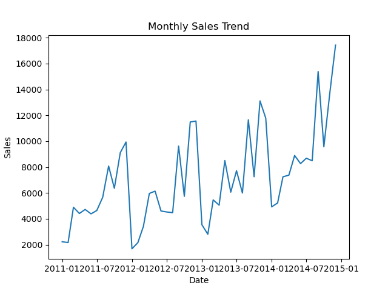

# 📊 STAT207 Mini Project #1 – Superstore Sales Analysis  
**Author:** Madelyn McNamara  

---

## 1. Introduction  
This project analyzes the **Superstore dataset** with a focus on understanding the factors that influence **sales performance**. My main question was:  

> *How do product categories and time (month/year) interact with profit to impact sales?*  

To explore this, I:  
- Cleaned and filtered the dataset to remove outliers  
- Investigated both numerical (profit, dates) and categorical (category, segment, region) variables  
- Evaluated interactions between variables using visualization and regression modeling  

The goal is to provide insights that would interest a **business analyst**, as it highlights what drives sales and profitability across different business segments.  

---

## 2. Dataset  
I used the [Superstore dataset from Kaggle](https://www.kaggle.com/datasets/vivek468/superstore-dataset-final).  
- **Rows:** 9,994 orders  
- **Columns:** 21 (including sales, profit, discount, order/ship dates, product details, etc.)  
- **Target Variables of Interest:** Sales, Profit, Order Date, Category  

---

## 3. Data Cleaning  
- Converted date columns to `datetime` format  
- Created new features: `Month`, `Year`, and `Month_Num`  
- Removed extreme outliers using **IQR filtering** (reduced dataset to ~7,000 rows)  
- Final dataset had **no missing values**  

---

## 4. Exploratory Data Analysis  

### 🔹 Sales vs Profit  
There is a **moderate positive correlation** between sales and profit (r ≈ 0.39).  
  
*Scatter plot showing that higher sales tend to correspond with higher profits, though with some variation.*  

---

### 🔹 Sales by Category  
Product category strongly impacts sales distribution. Technology items typically generate higher sales per order compared to furniture or office supplies.  
  
*Boxplot comparing sales distribution across product categories.*  

---

### 🔹 Monthly Sales Trends  
Sales show **seasonal fluctuations** across months, with noticeable peaks in Q4 (holiday season).  
  
*Line plot showing monthly aggregated sales trends over time.*  

---

### 🔹 Interactions Between Variables  
By comparing categories across months, we can see that **Technology sales peak later in the year**, while **Office Supplies remain steady throughout**.  
  
*Interaction between Category and Month on Sales.*  

---

## 5. Modeling & Statistical Results  
I built multiple linear models using **OLS regression** to test how combinations of variables explained Sales.  

- **Profit + Category** → R² = **0.27** (best-performing model)  
- **Profit + Region** → R² = 0.23  
- **Profit + Month_Num** → R² = 0.23  
- **Month_Num + Category** → R² = 0.05  

➡️ **Takeaway:** Profit is the strongest numerical predictor of sales, and Category is the strongest categorical predictor.  

---

## 6. Conclusion  
- **Profit and Category together explain the most variation in sales.**  
- **Seasonality matters**: Sales rise at the end of the year, especially for Technology.  
- While the predictive models are not extremely strong (R² < 0.3), the analysis still highlights important business insights.  

**Future Work:**  
- Incorporate **discounts** as an explanatory variable  
- Explore **customer-level trends** instead of only product-level  
- Use advanced machine learning models (e.g., random forests, gradient boosting) for better predictive performance  

---

## 7. Tools & Libraries  
- **Python**: pandas, numpy, matplotlib, seaborn, statsmodels  
- **Dataset**: Superstore dataset (Kaggle)  

---

## 📫 Contact  
👩 Madelyn McNamara  
- 📧 [mnm12@illinois.edu](mailto:mnm12@illinois.edu)  
- 🌐 [GitHub](https://github.com/maddymac) | [LinkedIn](https://linkedin.com/in/maddymac)  

---
